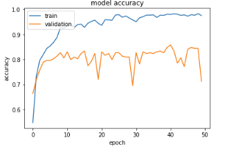
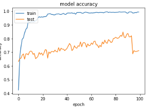

# Skin Cancer Detection Android App(Image Processing)
Here are the Codes, Datasets and the Android App required to create the Skin Cancer Detection App.

## Data
The dataset is orignally available at https://dataverse.harvard.edu/dataset.xhtml?persistentId=doi:10.7910/DVN/DBW86T .
follow the steps given on https://github.com/syed-hamza/Skin-Cancer-Android-App/blob/master/Data.md for dataset prepartion.

## Structure
The data should be arranged in the following struture. \
https://github.com/syed-hamza/Skin-Cancer-Android-App/blob/master/input.md

## Code
1) Inception-V3 - https://github.com/syed-hamza/Skin-Cancer-Android-App/blob/master/src/SkinCancer_inceptionModel.ipynb
2) nasnet - https://github.com/syed-hamza/Skin-Cancer-Android-App/blob/master/src/SkinCancer_nasnetmobile.ipynb

## Inference
The given code uses inception_v3 at https://keras.io/applications/#inceptionv3.Inception model gave me a slightly better result than nasnetmobile and training the model was comparitively quick.

### Inception(Validation_Accuracy):

**validation accuracy:85.76%**

### NasNetMobile(Validation_Accuracy):

**validation accuracy:84.72%**

From this we can conclude that eventhough nasnet fluctuates less than inception inception provides a better accuracy,hence is better suited for the app.

## Regards
I am a student in highschool and this is my first project using Deep Learning.
The following project took me several weekends along 2 months. I hope it is helpful to everyone reading this.
All suggetions are welcome.
